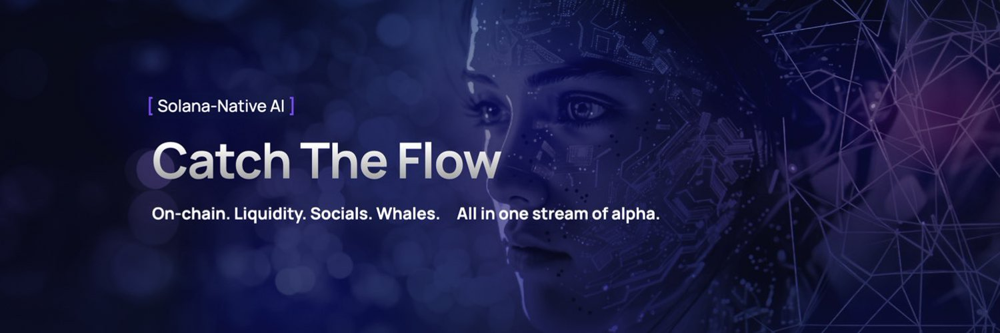
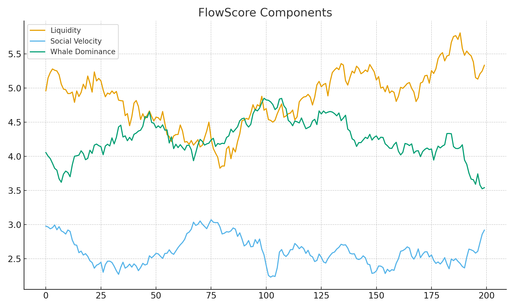
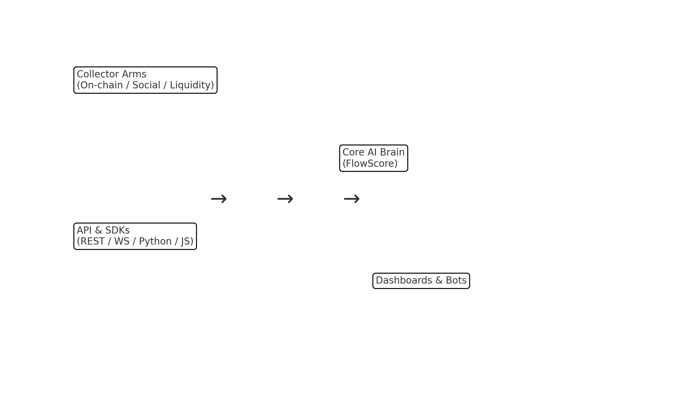

# 🐙 OctoFlow AI


**8 arms. 1 flow. Infinite alpha.**  
On-chain + socials + liquidity + whales → one stream of alpha.  
Built natively on **Solana**.
<p align="center">
  
</p>


## 🌊 Overview
OctoFlow AI is a **Solana-native intelligence engine** that unifies:
- **On-chain data** (transactions, holders, liquidity pools)
- **Socials** (X, Telegram, Reddit)
- **Liquidity flows** (DEX activity, inflows/outflows)
- **AI-powered sentiment & velocity detection**

All signals are fused into **FlowScore™** — a real-time alpha index you can trade on.

<p align="center">
  
</p>

## 📦 Packages
- `packages/python` – Python SDK
- `packages/node` – Node.js SDK
- `api` – mock REST API + WebSocket stream
- `cli` – command-line tools
- `docs` – images and diagrams
- `data/samples` – sample JSON payloads
- `notebooks` – research notebooks

## ⚡ Quickstart (Python)

```bash
pip install -e packages/python
```

```python
from octoflow import OctoFlow

client = OctoFlow(api_key="DEMO_KEY")
print(client.flow_score("SOL"))
```

## ⚡ Quickstart (Node.js)

```bash
cd packages/node && npm i
node examples/flowscore.js
```

## 📡 API Endpoints (Mock)

- `GET /api/flowscore/:symbol` – current FlowScore value
- `GET /api/whales/:symbol` – latest whale moves
- `GET /api/liquidity/:symbol` – liquidity inflow/outflow summary
- `GET /api/social/:symbol` – social velocity + sentiment
- `WS /stream` – real-time events

## 🗺 Architecture

<p align="center">
  
</p>

## 🧠 FlowScore™
FlowScore blends:
- whale dominance
- liquidity velocity
- social momentum
- on-chain activity density

into a single index from 0 to 100.

## 🛠 Roadmap
- ✅ Whale tracking + FlowScore core
- ✅ Python & Node SDKs
- ✅ Mock API + CLI
- 🔜 Advanced dashboard + alerts
- 🔜 Cross-chain (ETH, TON)
- 🔜 Strategy templates

---

**OctoFlow AI** — 8 arms, 1 flow, infinite alpha.
